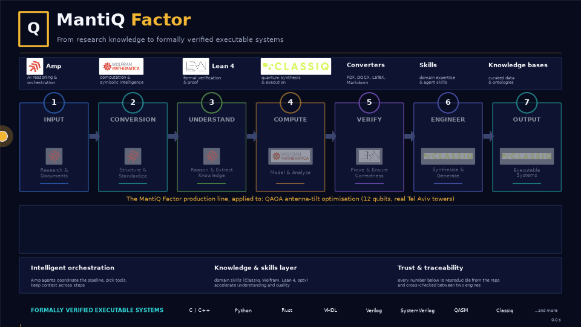

# MantiQ Factor case study: antenna tilt optimization with QAOA

From a PDF hackathon brief to a formally verified quantum program that runs on Classiq.

Six real Tel Aviv sector antennas (OpenCelliD), 2 qubits per antenna, 12 qubits, 4096 tilt plans.
The cost function is computed exactly in Wolfram Mathematica, its key properties are proved in Lean 4,
the circuit is written in Classiq Qmod, and the Classiq simulator reproduces the predicted numbers.




## The MantiQ Factor workflow

MantiQ Factor is a seven-stage production line for quantum applications. Each stage leaves a file on disk
that the next stage consumes, so every number in the final program traces back to a dataset, an exact
simulation or a theorem.

| Stage | What happened here | Artifact |
|---|---|---|
| 1 Input | Challenge brief (PDF), team Hamiltonian note, team k-means hierarchy concept (PDF), group deck (Google Slides), OpenCelliD CSV | `docs/`, `data/` |
| 2 Conversion | PDFs and slides to Markdown with LaTeX; CSV to interference matrix and coverage vector | `docs/qaoa_antenna_hamiltonian_explanation.md`, `data/opencellid_pipeline.py` |
| 3 Understand | Model decision: 2 qubits per antenna (2-local Ising, all states valid) instead of the team's 27-configuration 5-qubit pack; Pauli decomposition (73 terms: 1 I + 12 Z + 60 ZZ) | `gates/pauli_terms.json`, `gates/pauli_terms.md` |
| 4 Compute | Exact statevector QAOA in Wolfram: landscape over (gamma, beta), optimal angles for p = 1 and p = 2, VQE and Grover comparisons, shots-to-95% | `wolfram/wolfram_realdataset_algorithms.wl`, `.nb`, `.pdf`, `.json` |
| 5 Verify | Lean 4 + Mathlib theorems: encoding bijection, optimum value, lower bound, uniqueness, phase layer unitary and diagonal; 0 `sorry` | `lean/TiltQAOA.lean`, `lean/tilt_qaoa_lean_build.log` |
| 6 Engineer | Classiq Qmod: `QArray[QNum[2], 6]` register, cost as a `phase()` statement, synthesized circuit (width 12, depth 59, 92 CX) | `notebook/antenna_tilt_optimization.ipynb`, `.qmod`, `classiq/qaoa_tilt_classiq.py` |
| 7 Output | Classiq simulator run at the Wolfram angles, COBYLA refinement, comparison charts, this repository, the classiq-library demo | `classiq/results/`, `charts/`, `presentation/` |

## Key numbers

| Quantity | Value |
|---|---|
| Instance | 6 antennas x 4 tilt levels = 4096 plans, `data/opencellid_il2.csv` |
| Cost | Cost(t) = t^T I t - 1.5 c.t + 0.3 sum(t) |
| Classical optimum | -2.844 at tilts (0,3,0,0,0,0), unique (Lean theorems `costS_optTilt`, `costS_lower_bound`, `costS_unique`) |
| Hamiltonian | 73 Pauli terms, all weight <= 2 |
| Circuit p=1 / p=2 | depth 59 / 114, 92 / 184 CX, 72 / 144 RZ |
| QAOA p=1, (gamma, beta) = (0.06538, 1.12925) | Wolfram: <C> = 1.9985, P(cost<0) = 0.53, P(opt) = 0.0066 (27x uniform). Classiq 4096 shots: 2.02 to 2.06, 0.525 to 0.529, 0.0066 to 0.0076 |
| QAOA p=2 | Wolfram: <C> = -0.3825, P(cost<0) = 0.67. Classiq: -0.39 to -0.47, 0.65 to 0.67 |
| Shots for a 95% chance of sampling the optimum | uniform 12270, p=1 about 450, p=2 about 300 |
| COBYLA on Classiq from the Wolfram angles | 8 iterations, no improvement over the hot start |

## Contents

| Path | What |
|---|---|
| `notebook/` | Classiq notebook contributed to [Classiq/classiq-library](https://github.com/Classiq/classiq-library) as `applications/telecom/antenna_tilt_optimization`, with `.qmod`, `.synthesis_options.json`, `.metadata.json`, the library test, and `build_notebook.py` that generates it |
| `classiq/` | Standalone Qmod script with COBYLA (`qaoa_tilt_classiq.py`) and all sampled results, per-iteration logs and transpiled OpenQASM 3 |
| `wolfram/` | Exact statevector pipeline (`.wl`), notebook (`.nb`, evaluated `.nb`, `.pdf`, `.md`), angles and probabilities (`.json`), figures in `img/` |
| `lean/` | Lean 4 certificates and build log |
| `gates/` | Walsh-Hadamard Pauli decomposition of the cost table and an explicit QASM 2 QAOA layer |
| `data/` | OpenCelliD instance (6 antennas), interference matrix, pipeline and brute-force oracle scripts, `DATA_SOURCES.md` |
| `charts/` | Wolfram vs Classiq, quantum gain, convergence, circuit stats, notebook sampling figure, team benchmark charts |
| `animation/` | `mantiq_pipeline_animation.py` (matplotlib) and its outputs `mantiq_pipeline.mp4` (41 s, 1080p) and `mantiq_pipeline.gif` |
| `presentation/` | `MantiQ_Factor_Antenna_Tilt.pptx` and `.pdf` (16 slides, speaker notes), generated by `build_deck.js` (pptxgenjs) |
| `docs/` | MantiQ Factor diagram, converted Hamiltonian note, team hierarchical k-means + QAOA concept PDF |

## Reproduce

```powershell
# Classiq notebook (needs a Classiq account: `classiq authenticate`)
py -3.12 -m pip install classiq nbformat jupyter matplotlib pandas
py -3.12 notebook\build_notebook.py
py -3.12 -m jupyter nbconvert --to notebook --execute --inplace notebook\antenna_tilt_optimization.ipynb

# Standalone Classiq run with COBYLA
py -3.12 classiq\qaoa_tilt_classiq.py --layers 1 --shots 4096 --optimize 20 --start 0.06538,1.12925

# Wolfram exact simulation (~80 s)
wolframscript -file wolfram\wolfram_realdataset_algorithms.wl

# Lean 4 (inside a Lake project with Mathlib)
lake build

# Animation and deck
py -3.12 animation\mantiq_pipeline_animation.py
powershell -File "$HOME\.agents\skills\working-with-pptx\scripts\run-pptx-node.ps1" presentation\build_deck.js
```

## Related

- Hackathon repository (team Quantum Headache, QUBIT 2026): https://github.com/zuwasi/quantum-headache-antenna-tilt
- 5-minute demo video: https://youtu.be/OSEtTWnRQhc
- Classiq library demo PR: see `notebook/` and the link in the Releases/PR section once merged

## Data attribution

Antenna positions from [OpenCelliD](https://opencellid.org), licensed CC BY-SA 4.0. See `data/DATA_SOURCES.md`.

## License

MIT, see `LICENSE`.
